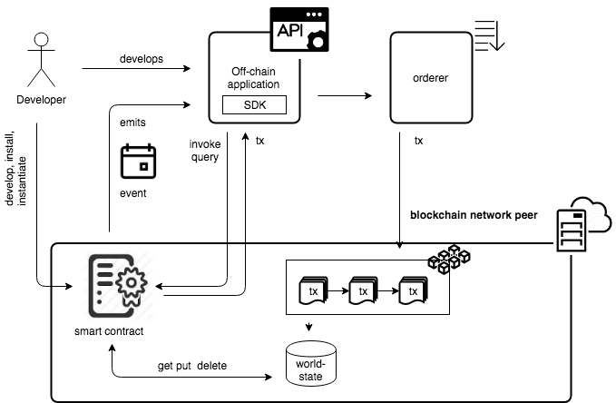

# Service oriented Hyperledger Fabric application development with CCKit

## Hyperledger Fabric application development evolution 

[Early](../docs/chaincode-examples.md) Hyperledger Fabric application implementations leveraged JSON data model, simple 
chaincode method routing and `REST` API architecture as the de-facto technology stack. 

`CCKit`, library for Hyperledger Fabric application development, addresses several aspects of Hyperledger Fabric 
application development:

* [Chaincode method routing](../router) allows to consistently define rules how an chaincode responds to a client requests

* [Using protocol buffers](../state) can help to define data model once and then easily write and read structured data to 
and from chaincode world state

* [Testing tools](../testing) enhances the development experience with extended version of MockStub for chaincode testing. 

Next step is to standardize following aspects of blockchain application development using Interface Definition Language (IDL):

* Chaincode interface definition
* Automatically create chaincode SDK and API's with code generation
* Automatically create chaincode documentation with code generation

Proposed methodology leverages power of `gRPC` services and messages definitions. A chaincode app developer may express the
interface to their application in a high level interface definition language, and CCKit `cc-gateway` generator will 
automatically generate:
 
* chaincode interface and helper for embedding service into chaincode router
* chaincode gateway for external access (can be used as SDK or exposed as `gRPC` or `REST` service)

## Blockchain network services

Blockchain network consists of multiple services, on-chain (chaincodes) and off-chain (API's and  other external to blockchain 
applications, interacts with smart contracts). 



For example, official 
[Commercial paper chaincode example](https://hyperledger-fabric.readthedocs.io/en/release-1.4/tutorial/commercial_paper.html) 
includes smart contract implementation and cli tools for interacting with deployed сhaincodes.
With external applications, implemented with different technologies and programming 
languages, it is important to have a standard way to define service interfaces and underlying message interchange formats. 

                                                                                                 
### Using gRPC ecosystem for chaincode development

### Fundamentals of gRPC

With `gRPC`, a client application can directly call methods on a server application on a remote machine as if it were a
local object.  `gRPC` is based on the foundations of conventional Remote Procedure Call (RPC) technology but implemented 
on top of the modern technology stacks such as HTTP2, protocol buffers etc. to ensure maximum interoperability. 
 
Like many RPC systems, `gRPC` is based around the idea of defining a service, specifying the methods that can be called 
remotely with their parameters and return types. `gRPC` technology stack natively supports a clean and powerful way to 
specify service contracts using the Interface Definition Language (`IDL`):

* messages defines data structures of the input parameters and return types.
* services definition outlines methods signatures that can be invoked remotely 

When the client invokes the service, the client-side gRPC library uses the protocol buffer and marshals the remote procedure 
call, which is then sent over HTTP2. On the server side, the request is un-marshaled and the respective procedure invocation
is executed using protocol buffers. The response follows a similar execution flow from the server to the client.

The main advantage of developing services and clients with gRPC is that your service code or client side code doesn’t need 
to worry about parsing JSON or similar text-based message formats. What comes in the wire is a binary format, which is 
unmarshalled into an object. Also, having first-class support for defining a service interface via an `IDL` is a powerful 
feature when we have to deal with multiple microservices and ensure and maintain interoperability.

### gRPC service as RESTful HTTP API

`gRPC` service can be exposed as `REST` service using [grpc-gateway](https://github.com/grpc-ecosystem/grpc-gateway)
plugin of the Google protocol buffers compiler protoc. It reads protobuf service definitions and generates a 
reverse-proxy server which 'translates a RESTful HTTP API into `gRPC`.

## Chaincode as service

> Application, interacting with smart contracts can be defined and implemented as `gRPC` service. But, what if chaincode 
itself implement with respect to service definition in `gRPC` format ?

### Chaincode interface

Chaincode defines a common set of contracts covering common terms, data, rules, concept definitions, and processes (for example,
[Commercial paper](https://hyperledger-fabric.readthedocs.io/en/release-1.4/tutorial/commercial_paper.html)  or 
[ERC20](https://medium.com/coinmonks/erc20-token-as-hyperledger-fabric-golang-chaincode-d09dfd16a339) token functionality),
implements some business logic and interacts with the shared ledger. Taken together, these contracts lay out the business model
 that govern all of the interactions between transacting parties.


Chaincode interface is very simple and contains only 2 methods:
 
```go
type Chaincode interface {
    // Init is called during Instantiate transaction
    Init(stub ChaincodeStubInterface) pb.Response
    // Invoke is called to update or query the ledger
    Invoke(stub ChaincodeStubInterface) pb.Response
}
````

Using `ChaincodeStubInterface` `getArgs` method chaincode implementation can access input parameters as slice (array) of bytes.

At the moment there is no standard way to describe chaincode interface via some definition language. But chaincode itself
can be considered as RPC'like service and defined with `gRPC` Interface Definition Language (IDL), for example:


```proto
service HelloService {
  rpc SayHello (HelloRequest) returns (HelloResponse);
}

message HelloRequest {
  string greeting = 1;
}

message HelloResponse {
  string reply = 1;
}
```

As this service definition strongly typed (input: `string` ad output: `string`) versus relaxed basic chaincode interface
(input: `[]byte` and output: `[]byte`) we need mechanisms for converting input `[]byte` to target parameter type, 
depending on service definition. 
 

## CCKit components for blockchain network layers

### Chaincode service to ChaincodeStubInterface mapper

Generated on top of `gRPC` service definition chaincode service mapper allows to embed chaincode service implementation into
 [CCKit router](../router), leveraging [middleware](../router/middleware) capabilities for converting input and output data.

For example, [Commercial Paper as service](../examples/cpaper_asservice/service/service.pb.cc.go) generated code contains
`RegisterCPaperChaincode` method which maps chaincode `Issue` method to chaincode service implementation:

```go
import (
	cckit_router "github.com/s7techlab/cckit/router"
	cckit_defparam "github.com/s7techlab/cckit/router/param/defparam"
)

const (
    ..
	CPaperChaincode_Issue = "Issue"
	...
)	
	
// RegisterCPaperChaincode registers service methods as chaincode router handlers
func RegisterCPaperChaincode(r *cckit_router.Group, cc CPaperChaincode) error {

    ...
	r.Invoke(CPaperChaincode_Issue,
		func(ctx cckit_router.Context) (interface{}, error) {
			return cc.Issue(ctx, ctx.Param().(*schema.IssueCommercialPaper))
		},
		cckit_defparam.Proto(&schema.IssueCommercialPaper{}))
    ...
    
}
```

### Chaincode invocation service

[Chaincode invocation service](service/chaincode.go) defines gRPC service for interacting with smart contract from external 
application with 3 methods:

* `Query` ( `ChaincodeInput` ) returns ( `ProposalResponse` )
* `Invoke` ( `ChaincodeInput` ) returns ( `ProposalResponse` )
* `Events` (`ChaincodeLocator` ) returns ( `ChaincodeEvent` )

This service used by `Chaincode gateway` or can be exposed separately as `gRPC` or `REST` API.
`CCKit` contains chaincode service [implementation](service/chaincode.go) based on https://github.com/s7techlab/hlf-sdk-go and
[version for testing](service/mock.go), based on [Mockstub](../testing)

```proto
syntax = "proto3";

package service;

import "github.com/hyperledger/fabric/protos/peer/proposal_response.proto";
import "github.com/hyperledger/fabric/protos/peer/chaincode_event.proto";

message ChaincodeInput  {
    // Chaincode name
    string chaincode = 1;
    // Channel name
    string channel =  2;

    // Input contains the arguments for invocation.
    repeated bytes args = 3;

    // TransientMap contains data (e.g. cryptographic material) that might be used
    // to implement some form of application-level confidentiality. The contents
    // of this field are supposed to always be omitted from the transaction and
    // excluded from the ledger.
    map<string, bytes> transient = 4;
}


message ChaincodeLocator   {
    // Chaincode name
    string chaincode = 1;
    // Channel name
    string channel =  2;
}

service Chaincode {
    // Query chaincode on home peer
    rpc Query (ChaincodeInput) returns (protos.ProposalResponse);
    rpc Invoke (ChaincodeInput) returns (protos.ProposalResponse);
    rpc Events (ChaincodeLocator) returns (stream protos.ChaincodeEvent);
}
```

## Chaincode gateway

[Chaincode gateway](chaincode.go) use chaincode service to interact with deployed chaincode. It knows about channel and 
chaincode name, but dont't know about chaincode method signatures.

Chaincode gateway supports [options](opt.go) for providing transient data during chaincode invocation, and encrypting/
decrypting data.

Using `gRPC` service definition we can generate gateway for particular chaincode, for example for `Commercial Paper`.
This gateway can be used as:

* `gRPC` service
* Chaincode SDK for using in other services
* `REST` service with [grpc-gateway](https://github.com/grpc-ecosystem/grpc-gateway)

For example, [generated chaincode gateway](../examples/cpaper_asservice/service/service.pb.cc.go) for 
[Commercial Paper example](../examples/cpaper_asservice) looks like this:

```go 

import (
    cckit_ccservice "github.com/s7techlab/cckit/gateway/service"
	cckit_gateway "github.com/s7techlab/cckit/gateway"
)
	
// gateway implementation
// gateway can be used as kind of SDK, GRPC or REST server ( via grpc-gateway or clay )
type CPaperGateway struct {
	Gateway cckit_gateway.Chaincode
}

// NewCPaperGateway creates gateway to access chaincode method via chaincode service
func NewCPaperGateway(ccService cckit_ccservice.Chaincode, channel, chaincode string, opts ...cckit_gateway.Opt) *CPaperGateway {
	return &CPaperGateway{Gateway: cckit_gateway.NewChaincode(ccService, channel, chaincode, opts...)}
}

type ValidatorInterface interface {
	Validate() error
}

func (c *CPaperGateway) Issue(ctx context.Context, in *schema.IssueCommercialPaper) (*schema.CommercialPaper, error) {
	var inMsg interface{} = in
	if v, ok := inMsg.(ValidatorInterface); ok {
		if err := v.Validate(); err != nil {
			return nil, err
		}
	}

	if res, err := c.Gateway.Invoke(ctx, CPaperChaincode_Issue, []interface{}{in}, &schema.CommercialPaper{}); err != nil {
		return nil, err
	} else {
		return res.(*schema.CommercialPaper), nil
	}
}

...

```

 
## CCKit Chaincode gateway generator
Chaincode-as-service gateway generator allows to generate all mentioned above components from `gRPC` service definition:
 

### Install the generator

`GO111MODULE=on go install github.com/s7techlab/cckit/gateway/protoc-gen-cc-gateway`


## Example

### Commercial paper chaincode 

#### Data model

[schema.proto](../examples/cpaper_asservice/schema/schema.proto)

```proto
syntax = "proto3";

package schema;

import "google/protobuf/timestamp.proto";
import "github.com/mwitkow/go-proto-validators/validator.proto";

// Commercial Paper state entry
message CommercialPaper {

    enum State {
        ISSUED = 0;
        TRADING = 1;
        REDEEMED = 2;
    }

    // Issuer and Paper number comprises composite primary key of Commercial paper entry
    string issuer = 1;
    string paper_number = 2;

    string owner = 3;
    google.protobuf.Timestamp issue_date = 4;
    google.protobuf.Timestamp maturity_date = 5;
    int32 face_value = 6;
    State state = 7;

    // Additional unique field for entry
    string external_id = 8;
}

// CommercialPaperId identifier part
message CommercialPaperId {
    string issuer = 1;
    string paper_number = 2;
}

// ExternalId
message ExternalId {
    string id = 1;
}

// Container for returning multiple entities
message CommercialPaperList {
    repeated CommercialPaper items = 1;
}

// IssueCommercialPaper event
message IssueCommercialPaper {
    string issuer = 1 [(validator.field) = {string_not_empty : true}];
    string paper_number = 2 [(validator.field) = {string_not_empty : true}];
    google.protobuf.Timestamp issue_date = 3 [(validator.field) = {msg_exists : true}];
    google.protobuf.Timestamp maturity_date = 4 [(validator.field) = {msg_exists : true}];
    int32 face_value = 5 [(validator.field) = {int_gt : 0}];

    // external_id  - once more uniq id of state entry
    string external_id = 6 [(validator.field) = {string_not_empty : true}];
}

// BuyCommercialPaper event
message BuyCommercialPaper {
    string issuer = 1 [(validator.field) = {string_not_empty : true}];
    string paper_number = 2 [(validator.field) = {string_not_empty : true}];
    string current_owner = 3 [(validator.field) = {string_not_empty : true}];
    string new_owner = 4 [(validator.field) = {string_not_empty : true}];
    int32 price = 5 [(validator.field) = {int_gt : 0}];
    google.protobuf.Timestamp purchase_date = 6 [(validator.field) = {msg_exists : true}];
}

// RedeemCommercialPaper event
message RedeemCommercialPaper {
    string issuer = 1 [(validator.field) = {string_not_empty : true}];
    string paper_number = 2 [(validator.field) = {string_not_empty : true}];
    string redeeming_owner = 3 [(validator.field) = {string_not_empty : true}];
    google.protobuf.Timestamp redeem_date = 4 [(validator.field) = {msg_exists : true}];
}
```

#### Chaincode as service

Chaincode interface can be described with gRPC [service](../examples/cpaper_asservice/service/service.proto) notation.
Using `grpc-gateway` option we can define mapping for chaincode REST-API.

The `grpc-gateway` is a plugin of the Google protocol buffers compiler `protoc`. It reads protobuf service definitions and 
generates a reverse-proxy server which 'translates a RESTful HTTP API into gRPC. This server is generated according
 to the `google.api.http` annotations in your service definitions.

```proto
syntax = "proto3";

package service;

import "google/api/annotations.proto";
import "google/protobuf/empty.proto";
import "github.com/s7techlab/cckit/examples/cpaper_asservice/schema/schema.proto";

service CPaper {
    // List method returns all registered commercial papers
    rpc List (google.protobuf.Empty) returns (schema.CommercialPaperList) {
        option (google.api.http) = {
            get: "/cpaper"
        };
    }

    // Get method returns commercial paper data by id
    rpc Get (schema.CommercialPaperId) returns (schema.CommercialPaper) {
        option (google.api.http) = {
            get: "/cpaper/{issuer}/{paper_number}"
        };
    }

    // GetByExternalId
    rpc GetByExternalId  (schema.ExternalId) returns (schema.CommercialPaper) {
        option (google.api.http) = {
            get: "/cpaper/extid/{id}"
        };
    }

    // Issue commercial paper
    rpc Issue (schema.IssueCommercialPaper) returns (schema.CommercialPaper) {
        option (google.api.http) = {
            post : "/cpaper/issue"
        };
    }

    // Buy commercial paper
    rpc Buy (schema.BuyCommercialPaper) returns (schema.CommercialPaper) {
        option (google.api.http) = {
            post: "/cpaper/buy"
        };
    }

    // Redeem commercial paper
    rpc Redeem (schema.RedeemCommercialPaper) returns (schema.CommercialPaper) {
        option (google.api.http) = {
            post: "/cpaper/redeem"
        };
    }

    // Delete commercial paper
    rpc Delete (schema.CommercialPaperId) returns (schema.CommercialPaper) {
        option (google.api.http) = {
            delete: "/cpaper/{issuer}/{paper_number}"
        };
    }
}
```

####  Generator

[Makefile](../examples/cpaper_asservice/Makefile)

```makefile
.: generate

generate:
	@protoc --version
	@echo "commercial paper schema proto generation"
	@protoc -I=./schema/ \
	-I=../../vendor \
	--go_out=./schema/    \
	--govalidators_out=./schema/ \
	./schema/schema.proto

	@echo "commercial paper service proto generation"
	@protoc -I=./service/ \
	-I=../../../../../ \
	-I=../../vendor \
	-I=../../third_party/googleapis \
	--go_out=plugins=grpc:./service/    \
 	--cc-gateway_out=logtostderr=true:./service/ \
	--grpc-gateway_out=logtostderr=true:./service/ \
    --swagger_out=logtostderr=true:./service/ \
	./service/service.proto
```

#### Chaincode implementation

Chaincode implementation must contain [state and event mappings](../examples/cpaper_asservice/service/service.pb.cc.go)

```go
type CPaperImpl struct {
}

func (cc *CPaperImpl) state(ctx router.Context) m.MappedState {
	return m.WrapState(ctx.State(), m.StateMappings{}.
		//  Create mapping for Commercial Paper entity
		Add(&schema.CommercialPaper{},
			m.PKeySchema(&schema.CommercialPaperId{}), // Key namespace will be <"CommercialPaper", Issuer, PaperNumber>
			m.List(&schema.CommercialPaperList{}),     // Structure of result for List method
			m.UniqKey("ExternalId"),                   // External Id is unique
		))
}

func (cc *CPaperImpl) event(ctx router.Context) state.Event {
	return m.WrapEvent(ctx.Event(), m.EventMappings{}.
		// Event name will be "IssueCommercialPaper", payload - same as issue payload
		Add(&schema.IssueCommercialPaper{}).
		// Event name will be "BuyCommercialPaper"
		Add(&schema.BuyCommercialPaper{}).
		// Event name will be "RedeemCommercialPaper"
		Add(&schema.RedeemCommercialPaper{}))
}
```

Chaincode service implementation must conform to generated from service definition
 [CPaperChaincode](../examples/cpaper_asservice/service/service.pb.cc.go) interface:

```go
func (cc *CPaperImpl) List(ctx router.Context, in *empty.Empty) (*schema.CommercialPaperList, error) {
	if res, err := cc.state(ctx).List(&schema.CommercialPaper{}); err != nil {
		return nil, err
	} else {
		return res.(*schema.CommercialPaperList), nil
	}
}

func (cc *CPaperImpl) Get(ctx router.Context, id *schema.CommercialPaperId) (*schema.CommercialPaper, error) {
	if res, err := cc.state(ctx).Get(id, &schema.CommercialPaper{}); err != nil {
		return nil, err
	} else {
		return res.(*schema.CommercialPaper), nil
	}
}

func (cc *CPaperImpl) GetByExternalId(ctx router.Context, id *schema.ExternalId) (*schema.CommercialPaper, error) {
	if res, err := cc.state(ctx).GetByUniqKey(
		&schema.CommercialPaper{}, "ExternalId", []string{id.Id}, &schema.CommercialPaper{}); err != nil {
		return nil, err
	} else {
		return res.(*schema.CommercialPaper), nil
	}
}

...

```

Then, chaincode service implementation can be embedded into chaincode method router with generated 
[RegisterCPaperChaincode](../examples/cpaper_asservice/service/service.pb.cc.go#L58) function:

```go 
func CCRouter(name string) (*router.Group, error) {
	r := router.New(name)
	// Store on the ledger the information about chaincode instantiation
	r.Init(owner.InvokeSetFromCreator)

	if err := service.RegisterCPaperChaincode(r, &CPaperImpl{}); err != nil {
		return nil, err
	}

	return r, nil
}
```