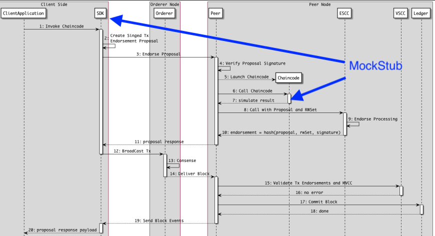

# Test Driven Hyperledger Fabric Golang chaincode development 

## How to fast and continuously check smart contract logic : blockchain transactions, fired events and chaincode permissioning

Testing stage is a critical requirement for software quality assurance, doesn't matter is this  
web application or a smart contract. Tests must be fast enough to run on every commit to repository. 
[CCKit](https://github.com/s7techlab/cckit/), programming toolkit for developing and testing Hyperledger Fabric Golang 
chaincodes, enhances the development experience with extended version of MockStub for chaincode testing. 

### Steps in chaincode development process

A smart contract defines the different states of a business object and governs the processes that move the object between 
these different states. Smart contracts allows architects and smart contract developers to define the 
business processes and structure of data that are shared across different organizations collaborating in a blockchain network.

The job of a smart contract developer is to take an existing business process and express it as a smart contract in a 
programming language. Steps of chaincode development:
    
*    Define chaincode model - schema for state entries, input payload and events
*    Define chaincode interface
*    Implement chaincode instantiate method
*    Implement chaincode methods with business logic
*    Create tests

Test driven development (TDD) or Behavioral Driven Development, possibly, single way to develop smart contracts.

### Chaincode (smart contract) testing 

Tests must ensure that chaincode works as expected:

* particular input payload leads to particular business object state change
* particular (invalid) input payload leads to validation or other errors
* particular object state allow subset of state transitions (state machine)

Any software testing (chaincode or web application for example) may either be a manual or an automated process. Manual 
software testing is led by a team or individual who will manually operate a software product and ensure it behaves as expected.
In case of chaincode tests you can manually invoke chaincode via `peer` cli tools.

Automated software testing is the practice of instrumenting input and output correctness checks for individual units of code.
During automated testing, code are executed in a test environment with simulated input.

### Running chaincode

Deploying chaincode to blockchain network isn't the quickest thing in the world, there's a lot of time that can be saved 
with testing. Also, more importantly, since blockchain is immutable and supposed to be secure because the code is on the
network, we rather not leave flaws in our code. 
           
During chaincode development and deploying to live network we can divide testing to multiple stage - fast stage, when 
testing only smart contract logic, and more complicated stage, when we do integration testing with live blockchain network,
multiple peers, deployed on-chain code (smart contracts) and off-chain application, that uses SDK to connect with
blockchain network peers. 

### Chaincode DEV mode

Deploying a Hyperledger Fabric blockchain network, chaincode installing and initializing, is quite complicated to set up and
a long procedure. Time to re-install / upgrade the code of a smart contract can be reduced by using 
[chaincode dev mode](https://hyperledger-fabric.readthedocs.io/en/latest/peer-chaincode-devmode.html). Normally chaincodes 
are started and maintained by peer. In “dev” mode, chaincode is built and started by the user. 
This mode is useful during chaincode development phase for rapid code/build/run/debug cycle turnaround. However, the process 
of updating the code will still be slow.

### MockStub - mocked chaincode stub

Mocking is a unit testing phenomenon which helps to test objects in isolation by replacing dependent objects with 
complex behavior with test objects with pre-defined/simulated behavior. These test objects are called as Mock objects.

The [shim](https://github.com/hyperledger/fabric/tree/master/core/chaincode/shim) package contains a 
[MockStub](https://github.com/hyperledger/fabric/tree/master/core/chaincode/shim/mockstub.go) implementation 
that wraps calls to a chaincode, simulating its behavior in the HLF peer environment. MockStub does not need to start 
multiple docker containers with peer, world state database, chaincodes and allows to get test results almost immediately.
MockStub essentially replaces the SDK and peer environment and allows to test chaincode without actually starting your 
blockchain network. It implements almost every function the actual stub does, but in memory.



`MockStub` from [https://github.com/hyperledger/fabric/](https://github.com/hyperledger/fabric/) repository includes 
implementation for most of `shim.ChaincodeStubInterface` function, but until current version 
of Hyperledger Fabric (1.4), the `MockStub` has not implemented some of the important methods such
as `GetCreator` or method for work with private state range, for example. Since chaincode would use `GetCreator`  method 
to get transaction creator certificate for access control, it's critical to be able to stub this method in order 
to completely unit-test chaincode.

### CCKit MockStub

CCKit [testing](.) package contains:

* [MockStub](mockstub.go) with implemented `GetTransient` and others methods and event subscription feature
* Test [identity](identity.go) creation helpers
* Chaincode response [expect](expect) helpers


# Example: `Commercial Paper` chaincode

## Scenario

Official hyperledger fabric documentation contain detailed 
[chaincode example](https://hyperledger-fabric.readthedocs.io/en/release-1.4/developapps/scenario.html) -  `Commercial Paper`
smart contract that defines the valid states for commercial paper, and the transaction logic that transition 
a paper from one state to another. We will test [commercial paper extended chaincode example](../examples/cpaper_extended) 
based on CCKit with protobuf state, described in this 
[article](https://medium.com/coinmonks/hyperledger-fabric-smart-contract-data-model-protobuf-to-chaincode-state-mapping-191cdcfa0b78).

We can represent the lifecycle of a commercial paper using a state transition diagram: commercial papers transition 
between issued, trading and redeemed states by means of the issue, buy and redeem transactions.


## Requirements 

To produce tests first we need to define requirements to tested application. Let’s start by listing our requirements 
for commercial paper chaincode:

* It should allow the issuer to issue commercial paper
* It should allow the participant to buy commercial paper
* It should allow the owner to redeem commercial paper

Chaincode interface functions described in file [chaincode.go](../examples/cpaper_extended/chaincode.go), so we can see 
all possible operations (transactions) with chaincode data:

```go 
    Query("list", queryCPapers).

    // Get method has 2 params - commercial paper primary key components
    Query("get", queryCPaper, defparam.Proto(&schema.CommercialPaperId{})).
    Query("getByExternalId", queryCPaperGetByExternalId, param.String("externalId")).

    // txn methods
    Invoke("issue", invokeCPaperIssue, defparam.Proto(&schema.IssueCommercialPaper{})).
    Invoke("buy", invokeCPaperBuy, defparam.Proto(&schema.BuyCommercialPaper{})).
    Invoke("redeem", invokeCPaperRedeem, defparam.Proto(&schema.RedeemCommercialPaper{})).
    Invoke("delete", invokeCPaperDelete, defparam.Proto(&schema.CommercialPaperId{}))

```

## Getting started

Before you begin, be sure to get `CCKit`:

`git clone git@github.com:s7techlab/cckit.git`

This will fetch and install the CCKit package with [examples](../examples). After that we need to install the dependencies 
using command:

`go mod vendor`

## Creating test suite 

### Testing in Go

Go has a built-in testing command called `go test` and a package `testing` which gives a minimal but complete 
testing experience. In our example we use [Ginkgo](https://github.com/onsi/ginkgo) - BDD-style Go testing framework, 
built on Go’s testing package, and allows to write readable tests in an efficient manner. It is best paired with
the [Gomega](https://github.com/onsi/gomega) matcher library, but is designed to be matcher-agnostic.

As with popular BDD frameworks in other languages, `Ginkgo` allows you to group tests in `Describe` and `Context` container blocks. 
`Ginkgo` provides the `It` and `Specify` blocks which can hold your assertions. It also comes with handy structural utilities
such as `BeforeSuite`, `AfterSuite`, etc that allows you to separate test configuration from test creation, and improve code reuse.

`Ginkgo` also comes with support for writing asynchronous tests. This makes testing code that use channels with chaincode events 
as easy as testing synchronous code.

### Test package 

To write a new test suite, create a file whose name ends _test.go that contains the TestXxx functions, in our case will 
be [cpaper_extended/chaincode_test.go](../examples/cpaper_extended/chaincode_test.go)

Using separate package with tests [cpaper_extended_test](../examples/cpaper_extended/chaincode_test.go) instead of 
[cpaper_extended](../examples/cpaper_extended/chaincode.go) allows us to respect
the encapsulation of the chaincode package: your tests will need to import chaincode and access it from the outside. 
You cannot fiddle around with the internals, instead you focus on the exposed chaincode interface.

### Import matchers and helpers

To get started, we need to import the `matcher` functionality from the Ginkgo testing package 
so we can use different comparison mechanisms like comparing response objects or status codes.

We import the `ginkgo` and `gomega` packages with the `.` namespace, so that we can use functions from these packages 
without the package prefix. This allows us to use `Describe` instead of `ginkgo.Describe`, and `Equal` instead 
of `gomega.Equal`.


### Bootstrap

The call to `RegisterFailHandler` registers a handler, the `Fail` function from the `Ginkgo` package. This creates the 
coupling between `Ginkgo` and `Gomega`.

Test suite bootstrap example:
```go
package main

import (
	"fmt"
	"testing"
	"github.com/s7techlab/cckit/examples/insurance/app"
	. "github.com/onsi/ginkgo"
	. "github.com/onsi/gomega"
	testcc "github.com/s7techlab/cckit/testing"
	expectcc "github.com/s7techlab/cckit/testing/expect"
)

func TestCommercialPaper(t *testing.T) {
	RegisterFailHandler(Fail)
	RunSpecs(t, "Commercial paper suite")
}

var _ = Describe(`Commercial paper`, func() {
	

}
```

### Test structure
This particular test specification can be written using `Ginkgo` as follows:

```go
var _ = Describe(`CommercialPaper`, func() {
	
            Describe("Commercial Paper lifecycle", func() {
            
                It("Allow issuer to issue new commercial paper", func() { ... }
                
                It("Allow issuer to get commercial paper by composite primary key", func() { ... }
                
                It("Allow issuer to get commercial paper by unique key", func() { ... }
                
                It("Allow issuer to get a list of commercial papers", func() { ... }
                
                It("Allow buyer to buy commercial paper", func() { ... }
                
                It("Allow buyer to redeem commercial paper", func() { ... }
                
                It("Allow issuer to delete commercial paper", func() { ... }
            }
}
```

### Implementing tests
    
Now we go in depth to see how to create test functions specifically for chaincode development using `MockStub` features.

#### Creating chaincode instance 

Tests suite usually starts with creating a new instance of chaincode, or we can also instantiate a new chaincode 
instance before every test spec. This depends on how and what we want to test. In this example we instantiate a global 
`commercial paper` chaincode  that can  be used in multiple test specs.

```go
	paperChaincode := testcc.NewMockStub(
		// chaincode name
		`commercial_paper`,
		// chaincode implementation, supports Chaincode interface with Init and Invoke methods
		cpaper_extended.NewCC(),
	)
```

####  Test chaincode `Init` method

All chaincode invocation (via SDK to blockchain peer or to MockStub) resulted as 
[peer.Response](https://github.com/hyperledger/fabric/blob/release-1.4/protos/peer/proposal_response.pb.go) structure:

```go
type Response struct {
	// A status code that should follow the HTTP status codes.
	Status int32 
	// A message associated with the response code.
	Message string 
	// A payload that can be used to include metadata with this response.
	Payload              []byte   
}
```

During tests we can check `Response` attribute:

* Status (error or success)
* Message string (contains error description)
* Payload contents (marshaled JSON or Protobuf)

`Testing` package [contains](expect/matcher.go) multiple helpers / wrappers on ginkgo `expect` functions.

Most frequently used helpers are:

* `ResponseOk` (*response* **peer.Response**) expects that peer response contains `ok` status code(`200`)
* `ResponseError` (*response* **peer.Response**)  expects that peer response contains error statuc code (`500`). Optionally
you can pass expected error substring.
* `PayloadIs`(*response* **peer.Response**, *target* **interface{}) expects that peer response contains `ok` status code (`200`) 
and converts response to **target** type using `CCKit` [convert](../convert) package

For example we can simply test that `Init` method (invoked when the chaincode is initialised) returns successful status code: 
 
```go
BeforeSuite(func() {
    // Init chaincode with admin identity

    adminIdentity, err := testcc.IdentityFromFile(MspName, `testdata/admin.pem`, ioutil.ReadFile)
    Expect(err).NotTo(HaveOccurred())

    expectcc.ResponseOk(
        paperChaincode.
            From(adminIdentity).
            Init())
})
````

## Test the `Issue` method

We expect that invocation of `issue` chaincode method will result in:
* response with `Ok` status
* event `IssueCommercialPaper` is fired

In the test we can invoke `issue` method via MockStub, check response status and check chaincode event. Chaincode events 
can be receive from `chaincodeEventsChannel`. The `BeEquivalentTo` method of the `expect` functionality 
comes in handy to compare the event payload.

```go
It("Allow issuer to issue new commercial paper", func(done Done) {
    //input payload for chaincode method
    issueTransactionData := &schema.IssueCommercialPaper{
        Issuer:       IssuerName,
        PaperNumber:  "0001",
        IssueDate:    ptypes.TimestampNow(),
        MaturityDate: testcc.MustProtoTimestamp(time.Now().AddDate(0, 2, 0)),
        FaceValue:    100000,
        ExternalId:   "EXT0001",
    }

    // we expect tha `issue` method invocation with particular input payload returns response with 200 code
    // &schema.IssueCommercialPaper wil automatically converts to bytes via proto.Marshall function
    expectcc.ResponseOk(
        paperChaincode.Invoke(`issue`, issueTransactionData))

    // Validate event has been emitted with the transaction data
    Expect(<-paperChaincode.ChaincodeEventsChannel).To(BeEquivalentTo(&peer.ChaincodeEvent{
        EventName: `IssueCommercialPaper`,
        Payload:   testcc.MustProtoMarshal(issueTransactionData),
    }))

    // Clear events channel after a test case that emits an event
    paperChaincode.ClearEvents()
    close(done)
}, 0.1)
```

 This test will block until a response is received over the channel `paperChaincode.ChaincodeEventsChannel` (chaincode event).
 A deadlock or timeout is a common failure mode for tests like this. A common pattern in such situations is to add a select 
 statement at the bottom of the function and include a <-time.After(X) channel to specify a timeout. Ginkgo has this pattern
 built in. The body functions in all non-container blocks (`It` , `BeforeEache` etc ) can take an optional done `Done` argument.
 
 Done is a `chan interface{}`. When `Ginkgo` detects that the `done Done` argument has been requested it runs the body function 
 as a goroutine, wrapping it with the necessary logic to apply a timeout assertion. You must either close the done channel, 
 or send something (anything) to it to tell `Ginkgo` that your test has ended. If your test doesn’t end after a timeout period,
 `Ginkgo` will fail the test and move on the next one.
 
 The default timeout is 1 second. You can modify this timeout by passing a float64 (in seconds) after the body function.
 In this example we set the timeout to 0.1 second.

## Test the `Get` method

We expect that invocation of `get` chaincode method will result in:
* response with `Ok` status
* response payload is marshaled `*schema.CommercialPaper` with certain attributes values

`PayloadIs` allows to check response status and converts to `*schema.CommercialPaper`, then `Expect` helps to check
equality of received data with expected values:

```go
It("Allow issuer to get commercial paper by composite primary key", func() {
    queryResponse := paperChaincode.Query("get", &schema.CommercialPaperId{
        Issuer:      IssuerName,
        PaperNumber: "0001",
    })

    // we expect that returned []byte payload can be unmarshalled to *schema.CommercialPaper entity
    paper := expectcc.PayloadIs(queryResponse, &schema.CommercialPaper{}).(*schema.CommercialPaper)

    Expect(paper.Issuer).To(Equal(IssuerName))
    Expect(paper.Owner).To(Equal(IssuerName))
    Expect(paper.State).To(Equal(schema.CommercialPaper_ISSUED))
    Expect(paper.PaperNumber).To(Equal("0001"))
    Expect(paper.FaceValue).To(BeNumerically("==", 100000))
})
```

### Test chaincode permissioning

Each user can have different permissions to work with chaincode methods. All permissioning is based on user certificates 
and Membership Service Provider Identifiers, which means that permissions always correspond to an X.509 certificate.

The simple [car](../examples/cars) contains logic to control who can invoke `carRegister` method. 
[Test](../examples/cars/cars_test.go) use `From` MockStub method to set certificate and MSP id of invoker
                                                                         
```go 

	It("Disallow non authority to add information about car", func() {
			//invoke chaincode method from non authority actor
			expectcc.ResponseError(
				cc.From(actors[`someone`]).Invoke(`carRegister`, cars.Payloads[0]),
				owner.ErrOwnerOnly) // expect "only owner" error
		})

	It("Allow authority to add information about car", func() {
			//invoke chaincode method from authority actor
			expectcc.ResponseOk(cc.From(actors[`authority`]).Invoke(`carRegister`, cars.Payloads[0]))
    })

```


### Debugging operations with chaincode

During test execution you may need to debug operations in chaincode method handler. `CCKit` supports
Hyperledger Fabric 
[Chaincode Logger](https://github.com/hyperledger/fabric/blob/release-1.4/core/chaincode/shim/chaincode.go#L1105)
and its options, so you can use `CORE_CHAINCODE_LOGGING_LEVEL` environment 
variable. `CCKit` [chaincode state wrapper](../state) outputs debug severity level messages, for example:

```shell
## CORE_CHAINCODE_LOGGING_LEVEL=debug go test
Running Suite: Commercial Paper Suite
=====================================
Random Seed: 1559680577
Will run 7 of 7 specs

2019-06-04 ... [commercial_paper] Debug -> DEBU 001 router handler:  init
2019-06-04 ... [commercial_paper] Debugf -> DEBU 002 state KEY: [OWNER]
2019-06-04 ... [commercial_paper] Debugf -> DEBU 003 state check EXISTENCE OWNER
2019-06-04 ... [commercial_paper] Debugf -> DEBU 007 state PUT with string key: OWNER
2019-06-04 ... [commercial_paper] Debug -> DEBU 008 router handler:  issue
2019-06-04 ... [commercial_paper] Debugf -> DEBU 009 state KEY: [_idx CommercialPaper ExternalId EXT0001]
2019-06-04 ... [commercial_paper] Debugf -> DEBU 00a state check EXISTENCE _idxCommercialPaperExternalIdEXT0001
2019-06-04 ... [commercial_paper] Debugf -> DEBU 00b state KEY: [_idx CommercialPaper ExternalId EXT0001]
2019-06-04 ... [commercial_paper] Debugf -> DEBU 00c state PUT with string key: _idxCommercialPaperExternalIdEXT0001
```

It shows there are several operations with chaincode state performed  while chaincode execution:
* checked existence entry with `OWNER` key while handling `init` chaincode method
* putted state entry with `OWNER` key
* putted state entry with `[_idx CommercialPaper ExternalId EXT0001]` while handling `issue` chaincode method 
(no uniq index for `Commercial entry` entity)
...
 
## Running test

To run the test suite you have to simply run the command in the repository where the test suite is located:

`go test`

if you have any failures in test you can use `-ginkgo.failFast` option to disable running additional tests 
after any test fails.


## Conclusion

Chaincode `MockStub` is really useful as it allows a developer to test his chaincode without starting the network every time. 
This reduces development time as he can use a test driven development (TDD) approach where he doesn’t 
need to start the network (this takes +- 40-80 seconds depending on the specs of the computer).